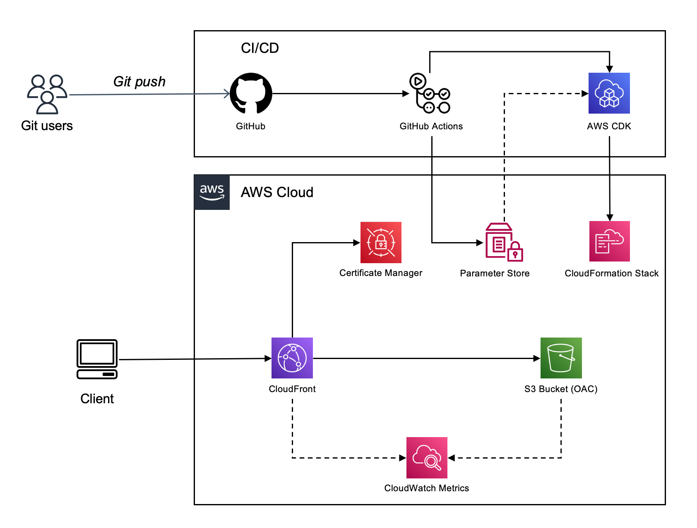

# Personal Static Web Site with AWS CDK (TypeScript)

Welcome to the **Personal Static Web Site** project! This project leverages the **AWS Cloud Development Kit (CDK)** with **TypeScript** to define and provision cloud infrastructure using code. It demonstrates real-world examples for deploying a personal static web site using AWS services.

---

## Requirements

- Good user experience: fast loading, no downtime.
- Easy to change: easy to update content.
- Own domain: use a custom domain name.

---

## Architecture

The personal web site is hosted on **Amazon S3** with **CloudFront** for content delivery. The site is deployed using **GitHub Actions**.

- Amazon S3: Is a highly scalable, reliable, and low-latency data storage infrastructure.
- CloudFront: Is a fast content delivery network (CDN) service that securely delivers data, videos, applications, and APIs to customers globally.
- Certificate Manager: Is a service that lets you easily provision, manage, and deploy public and private Secure Sockets Layer/Transport Layer Security (SSL/TLS) certificates for use with AWS services and your internal connected resources.
- Parameter Store: Is a service that provides secure, hierarchical storage for configuration data management and secrets management.
- CloudWatch: Is a monitoring and observability service built for DevOps engineers, developers, site reliability engineers (SREs), and IT managers.
- GitHub Actions: Is a CI/CD service that makes it easy to automate all your software workflows.

The architecture diagram is shown below:

---

## Deployment

To deploy the personal web site, you need to follow these steps:

### OIDC Identity Provider

This repository uses an OIDC identity provider to authenticate users following security best practices to avoid exposing or leaking user access keys. You need to create an OIDC identity provider in AWS. For more information, see [Configuring OpenID Connect in Amazon Web Services](https://docs.github.com/en/actions/security-for-github-actions/security-hardening-your-deployments/configuring-openid-connect-in-amazon-web-services).

### Secrets on GitHub

You'll need to add the following secrets to your GitHub repository:

- CERTIFICATE: Pem encoded certificate.
- PRIVATE_KEY: Pem encoded private key.
- CHAIN: Pem encoded certificate chain.
- AWS_ROLE_ARN: AWS IAM role ARN for OIDC.
- AWS_ACCOUNT_ID: AWS account ID.

The secrets are used to create an SSL certificate in AWS Certificate Manager. The certificate ARN is stored in the Parameter Store. The certificate ARN is used to create a CloudFront distribution.

### GitHub Actions

The GitHub Actions workflow is defined in the `.github/workflows/personalwebsite.yml` file. The workflow is nottriggered when a push event occurs on the main branch, but you can customize it to trigger the workflow based on your requirements. The workflow is triggered manually. You can chose to trigger deploy or destroy jobs.

### Configuring DNS

You need to configure your DNS settings to point to the CloudFront distribution. For more information, see [Routing traffic to an Amazon CloudFront web distribution by using your domain name](https://docs.aws.amazon.com/AmazonCloudFront/latest/DeveloperGuide/CNAMEs.html).

In my case, I'm using [IONOS](https://www.ionos.es/) to manage my domain. I've created a CNAME record to point to the CloudFront distribution.
